

  <a href="README.md">README</a>
  &nbsp;&nbsp;•&nbsp;&nbsp;
  <a href="#-fullvolumecharter">CHARTER</a>
  &nbsp;&nbsp;•&nbsp;&nbsp;
  <a href="FullVolume.md">ROADMAP</a>

  

### The karaoke game that plays *your own* music library.

A spiritual successor to Xbox 360 *LIPS*, built for PC. Point it at the songs already sitting on your drive and sing any of them - on your own, or in a room online with your buddies.

<a href="https://github.com/iamjrmh/FullVolumeTheGame/releases/latest/download/FullVolumeSetup.exe"> **Download FullVolume on GitHub →**</a>

<a href="https://jurmr.itch.io/fullvolume"> **Download FullVolume on itch.io →**</a>

> This repository is the **download and issue tracker** for FullVolume. The game itself is closed source, so there is no game code here - just the installer, the release notes, and somewhere to shout at me when it breaks.

---

## 🎤 What It Is

Every karaoke game wants to sell you the music. FullVolume hasn't got any to sell. It reads the songs already on your drive and turns them into a proper karaoke night: lyrics, pitch, scoring, stars, the lot.

- **It actually hears you** - land the note and it knows, nail it dead centre and it *really* knows. Sing it an octave down if that's where your voice lives, it still counts
- **Your library, not a store** - point it at your Clone Hero or Rock Band folders and it takes it from there. Songs nobody sings on are quietly left out, so you never pick a track and find there's nothing to sing
- **Line up a set list** - queue songs while somebody else is still singing, so the night runs itself instead of stopping dead between every track
- **Online, with voices** - name a room, send it to your buddies, and sing together from wherever you are. Voice chat is part of the game, not something you bolt on beside it
- **Make it your room** - every last bit of it is hand drawn, and if you don't fancy the room, drop in a picture or a video of your own and that's your stage instead
- **Tuned to your gear** - one button and it sorts out your audio delay on its own, or tap along for a few bars and let it work you out

---

## 🖥️ Screenshots

Straight out of the game. Nothing here is a mock-up.

  

<h3 align="center">The menus</h3>

  
  <em>Press start.</em>
    
  
  <em>Sign in, play as a guest, or make a profile.</em>
    
  
  <em>Play, Multiplayer, Settings, Quit.</em>

<h3 align="center">Your library</h3>

  
  <em>Your library, with your best score on every row.</em>
    
  
  <em>Queue up a set list before anyone argues.</em>

<h3 align="center">Singing</h3>

  
  <em>The intro card, while the chart loads.</em>
    
  
  <em>The vocal track, waiting for the first phrase.</em>
    
  
  <em>Pause, with the settings you can change mid-song.</em>
    
  
  <em>Stars, streak, and how close to perfect you got.</em>

<h3 align="center">Multiplayer</h3>

  
  <em>Public rooms, listed and joinable.</em>
    
  
  <em>Host one: name it, lock it, cap it.</em>
    
  
  <em>Or join with a name and a code.</em>
    
  
  <em>The lobby, with live voice and chat.</em>
    
  
  <em>It checks everyone actually has the song.</em>

---

## 📥 Installing

1. Grab **`FullVolumeSetup.exe`** from the [latest release](../../releases/latest).
2. Run it. It installs **per user**, so there is no UAC prompt and no admin rights needed - hand it to four friends and that's four installs and zero arguments with IT.
3. It lands in `%USERPROFILE%\Program Files\Full Volume`, with shortcuts on the Start menu and desktop.
4. Launch it, plug a microphone in, and pick it under **Settings → Audio**.

Uninstall it whenever you like. Profiles, scores, backdrops and song folders live outside the install and are never touched.

| | |
|---|---|
| **File** | `FullVolumeSetup.exe` |
| **Size** | 250 MB |
| **Version** | 0.9.2 beta |
| **Runs on** | Windows 10 and 11, 64-bit |
| **Account** | Local. Nothing to sign up for |
| **Songs included** | None. You bring those |

---

## 🎵 Setting Up Your Songs

If you've already got a Clone Hero song folder, you've already got a set list. Nothing to convert, nothing to import, nothing to buy.

1. **Point it at your songs** - **Settings → Library → Add Folder**. Add as many as you've got, on as many drives as you like.
2. **Put the kettle on** - it reads through them once, tells you how it's getting on, and then remembers. You'll not wait on it again.
3. **Sing** - search it, sort it, pick something, and go. It opens on the list, not on a loading bar.

**What it reads:**

- Clone Hero song folders, exactly as they sit on your drive
- `.sng` archives, read straight out of the file
- Rock Band `_rb3con` packages, no unpacking first
- UltraStar `.txt` charts
- `.fvchart` files, written by [FullVolumeCharter](#-fullvolumecharter)
- Album art, so the list looks like your record shelf

Songs with no vocal part are left out of the list on purpose.

### Getting the timing right

Every PC has a different audio delay. **Settings → Calibration** measures it for you in one button press, or you can tap along for a few bars and let it work you out. Do this once and everything lines up.

### Your own backdrops

Drop a picture or a video into `Documents\Full Volume\Custom\Backgrounds` and it turns up in the backdrop carousel. Menus and gameplay each get their own pick, so you can have one for the lobby and another for the stage.

### Where your stuff lives

Everything you make is in **`Documents\Full Volume`** - profiles, scores, your backdrops, and the list of song folders you added. The uninstaller deliberately never touches it.

---

## 🌐 Multiplayer

Host a room from inside the game, send it round, and sing together from wherever you all are.

- Public rooms are listed in the game and joinable in one click, or put a code on one and keep it to yourselves
- Say how many singers it takes and it holds the door at that
- Anyone can queue a song, and it says up front who hasn't got it
- Open mics in the lobby, push to talk once a song starts, so nobody's singing comes back at you over the music
- Everyone stays in time wherever they are, with everybody's score on screen at once

---

## 🎚️ FullVolumeCharter

> **Coming with FullVolume 0.9.3.** Everything below is the tool as it stands today, screenshots and all. The download link is live the moment the release is.

The game plays the vocal part that is already inside a Clone Hero or Rock Band chart. That covers tens of thousands of songs, and it does not cover the one you wanted at half past eleven on a Friday. **FullVolumeCharter** is how that one gets a part to sing.

Audio in, `.fvchart` out. It walks a song through seven steps and hands back a single file carrying the words, the timing, the pitches, the album art and the audio. Drop it in a folder the game is watching and it is on the list.

  <a href="https://fullvolumethegame.xyz/fullvolumecharter/">
  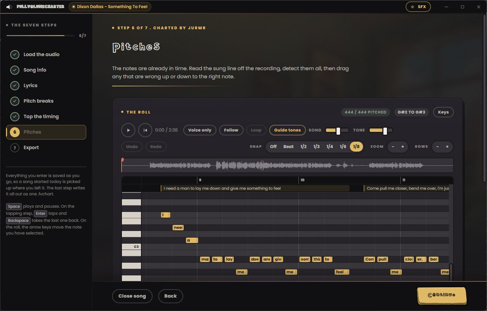
  </a>

<a href="https://github.com/iamjrmh/fullVolumeTheGame/releases/latest/download/FullVolumeCharterSetup.exe"> **Download FullVolumeCharter →**</a>

<a href="https://fullvolumethegame.xyz/fullvolumecharter/">**Read the whole thing at fullvolumethegame.xyz →**</a>

### The seven steps

1. **Load the audio** - one file, or the vocal and the backing as separate stems. Cover art, a backdrop and a timed `.lrc` sitting beside the track come in with it.
2. **Song info** - title, artist, album, genre, year, language, and your name on it in whatever colours you like. The tempo is worked out from the audio, with halve, double and tap tempo to correct it.
3. **Lyrics** - paste the words and they are split into the syllables actually sung, by the rules of the language you picked. Fix one by hand and it has learned that word.
4. **Pitch breaks** - click a word for every extra pitch it passes through while it is held. Each `+` is one more note on the same word.
5. **Tap the timing** - play the song and tap Enter as each syllable starts. Slow it to 50, 65 or 80 per cent and it *stays in its own key*, so a fast line is still singable while you tap it.
6. **Pitches** - the sung line is read straight off the recording, a phrase at a time, and you drag anything it got wrong. A guide tone plays the note under the cursor.
7. **Export** - one `.fvchart` with all of it inside. Open the same file later and it puts you back on whichever step you want.

Everything you enter is saved the moment you enter it, so a song started tonight is picked up tomorrow exactly where you stopped.

<h3 align="center">The seven steps, on screen</h3>

  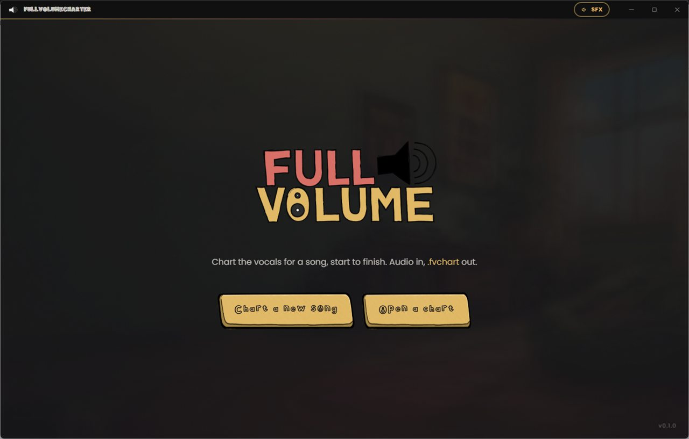
  <em>Start a new one, or open one you wrote.</em>
    
  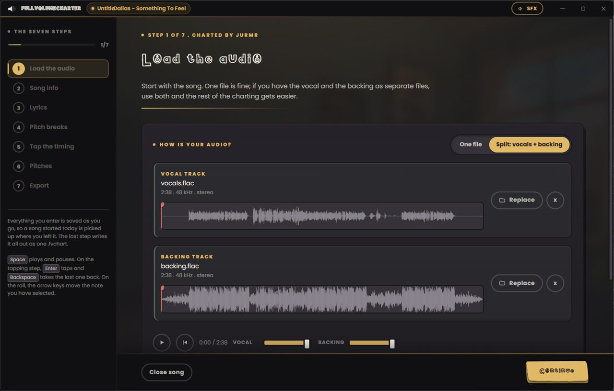
  <em>Step 1. One file, or a vocal and a backing.</em>
    
  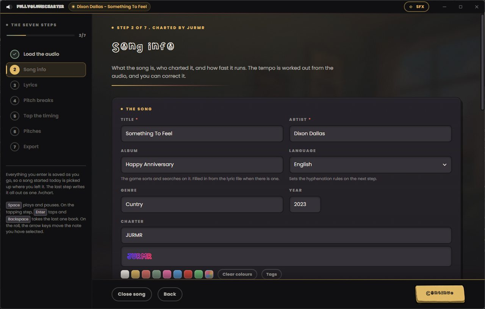
  <em>Step 2. Your name on it, in your own colours.</em>
    
  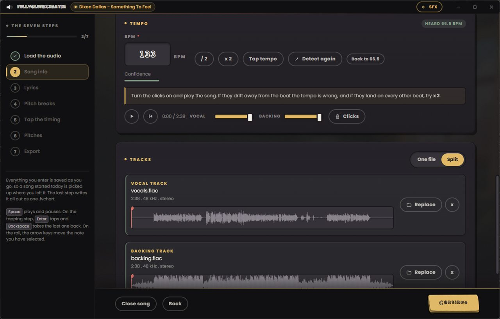
  <em>Step 2. The tempo, heard and correctable.</em>
    
  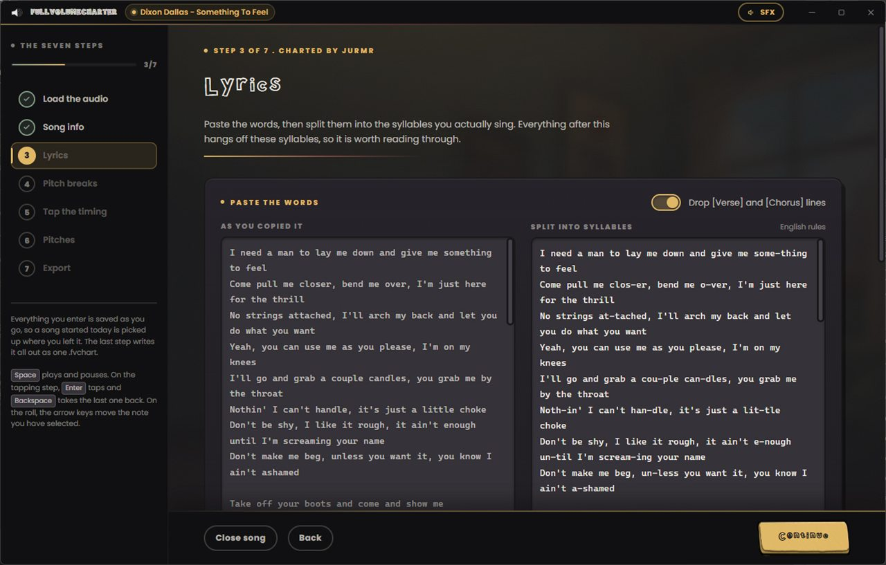
  <em>Step 3. Pasted words on the left, sung syllables on the right.</em>
    
  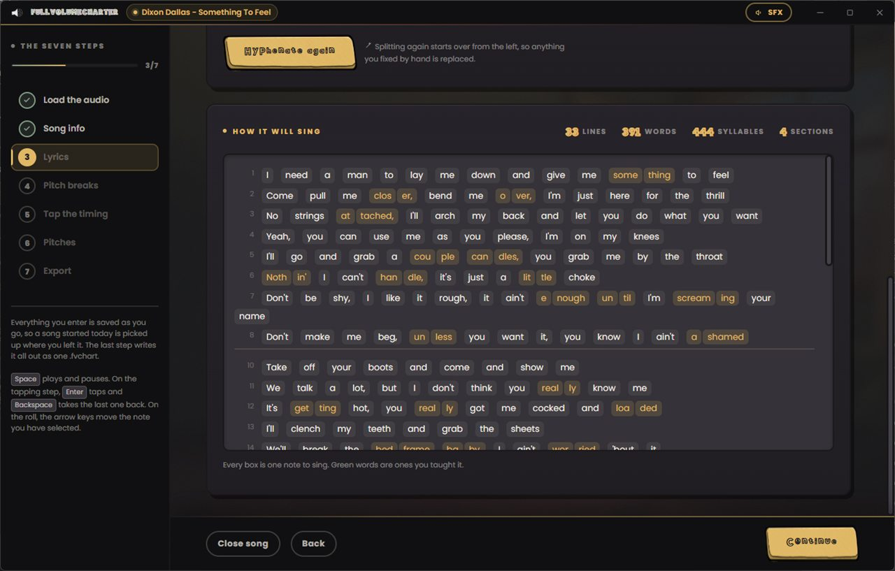
  <em>Step 3. How it will sing, box by box.</em>
    
  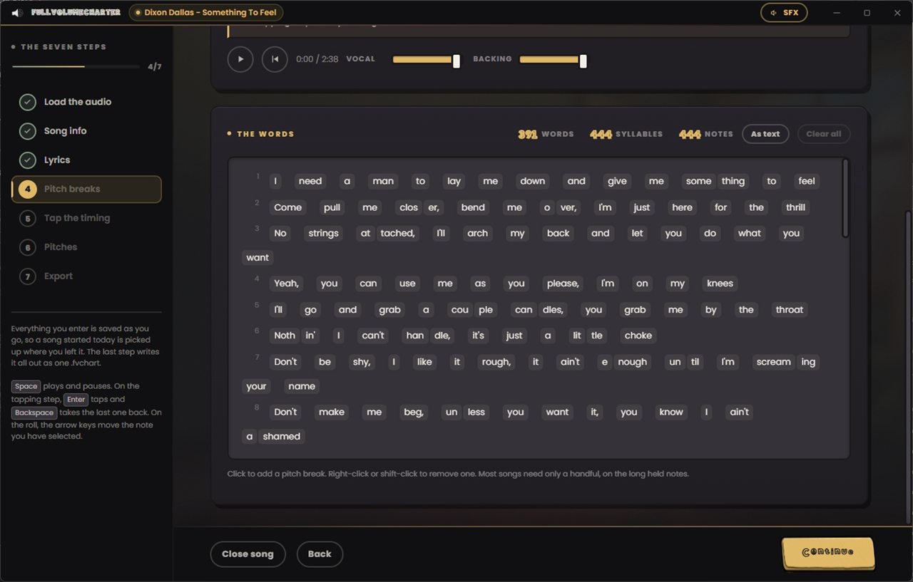
  <em>Step 4. Click a word for every pitch it moves through.</em>
    
  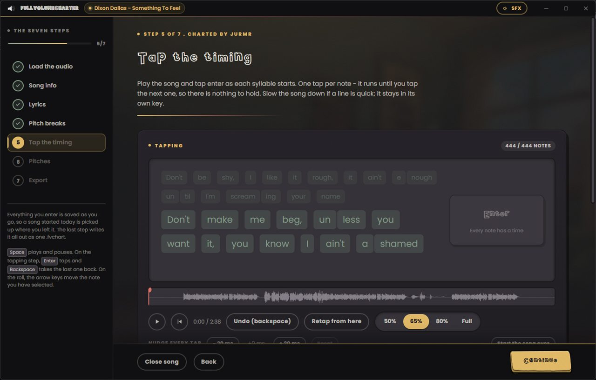
  <em>Step 5. One tap per note, at whatever speed you can manage.</em>
    
  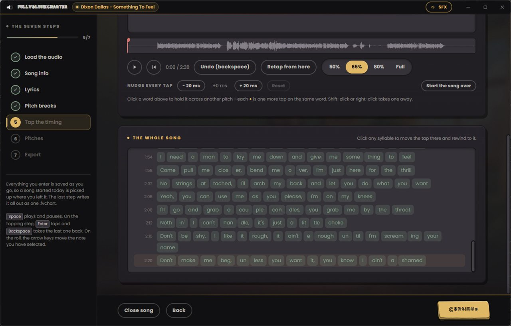
  <em>Step 5. Jump back to any syllable.</em>
    
  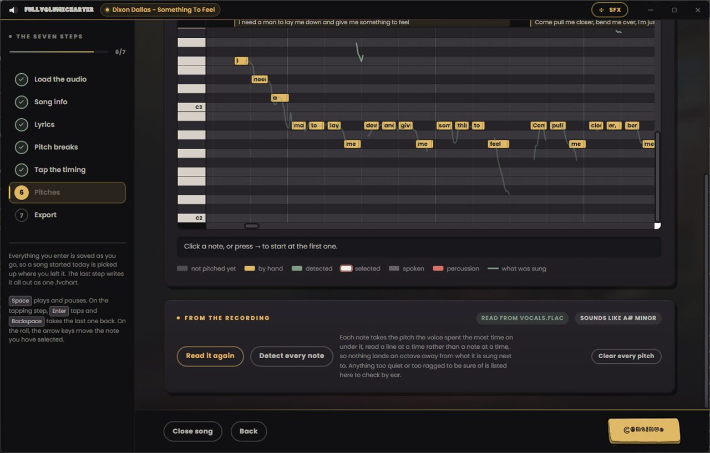
  <em>Step 6. What was sung, drawn behind the notes.</em>
    
  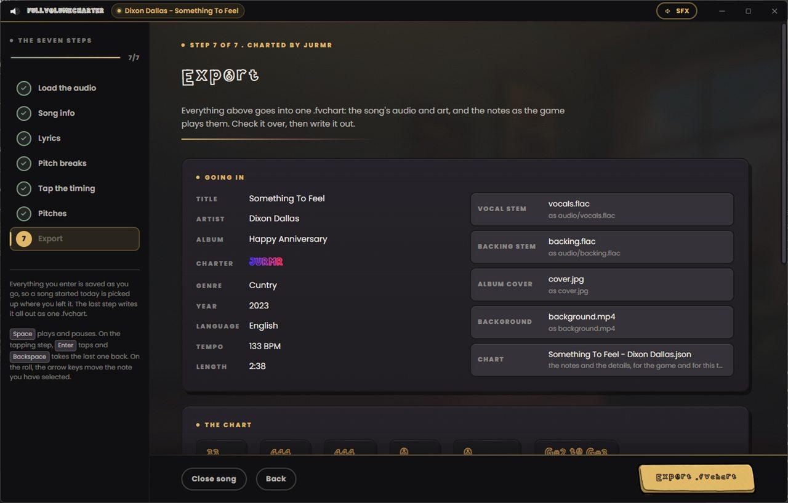
  <em>Step 7. Everything that is going in.</em>
    
  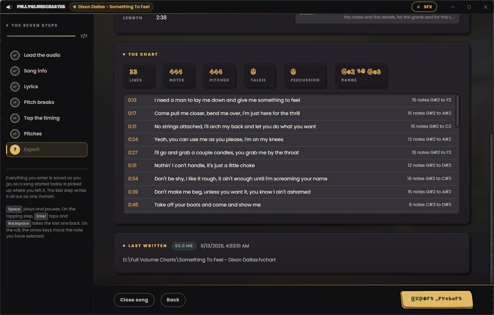
  <em>Step 7. And what came out.</em>

| | |
|---|---|
| **File** | `FullVolumeCharterSetup.exe` |
| **Charter version** | 0.1.0 |
| **Lands with** | FullVolume 0.9.3 |
| **Runs on** | Windows 10 and 11, 64-bit |
| **Account** | None |
| **Writes** | `.fvchart` |

A `.fvchart` carries the song's audio inside it, so passing one around means passing the recording around. Inside the game, a chart can be handed straight to somebody in your room who has not got it, which is usually what you actually want.

---

## 🧰 System Requirements

<table>
<tr><th></th><th>Minimum</th><th>Recommended</th></tr>
<tr><td><b>OS</b></td><td>Windows 10, 64-bit</td><td>Windows 11, 64-bit</td></tr>
<tr><td><b>Processor</b></td><td>Any dual core from the last ten years</td><td>Any quad core</td></tr>
<tr><td><b>Memory</b></td><td>4 GB RAM</td><td>8 GB RAM</td></tr>
<tr><td><b>Graphics</b></td><td>Anything that does DirectX 11</td><td>DirectX 12 or Vulkan</td></tr>
<tr><td><b>Storage</b></td><td>200 MB available space</td><td>200 MB, plus room for your songs</td></tr>
<tr><td><b>Sound</b></td><td>A microphone. Any microphone.</td><td>A headset or USB microphone</td></tr>
</table>

You bring the songs. A Clone Hero or Rock Band library is all it asks for.

---

## 🙏 Credits and Third Party Work

FullVolume is closed source for now, and that is exactly why this list matters: you
cannot read the code to see what is in it, so it is written out here instead. If
something of yours belongs on this list and is not on it, open an issue and it goes on.

### The charting community

Every song in this game was charted by somebody for nothing. The vocal part FullVolume
reads is the `PART VOCALS` track that Rock Band charters, Clone Hero charters and
UltraStar charters wrote by hand, and there would be no game without them. Thanks in
particular to the people who keep charting vocals when almost nothing plays them.

### Rock Band file formats

FullVolume reads `_rb3con` packages and the `.mogg` audio inside them. Neither format
is documented by Harmonix. Both are readable today only because the Rock Band modding
community reverse engineered them over a decade and published what they found.

The mogg decryption in FullVolume is an independent C# implementation, written against
that published work rather than copied from any one project, and the constant tables it
uses are Harmonix's own, long since extracted and republished by the people below. No
source from any of these projects is compiled into FullVolume, and none of them is
endorsing this. The debt is still theirs:

- **TrojanNemo** for [Nautilus / NautilusFREE](https://github.com/trojannemo/Nautilus),
  the reference toolkit for Rock Band files and the most complete public treatment of
  the mogg format there is.
- **LocalH** for **moggulator**.
- **Dark** for **themethod3**.
- The wider **Rock Band modding and Customs Creators community**, whose accumulated
  documentation of CON packages, `songs.dta` and the mogg versions is the only reason
  any of this parses.

### Chart catalogues

The in-game **GET SONGS** browser searches and downloads from two community catalogues:

- **[Rhythmverse](https://rhythmverse.co)**, run by Hive. Rhythmverse has no public API,
  so the game calls the same `songfiles` endpoints the site's own browse page calls, at
  the site's own pace, and takes each file through the normal
  `rhythmverse.co/download/<id>` page so the download is counted for the charter who
  uploaded it. Nothing is mirrored, rehosted or cached anywhere else. If Hive would
  rather it worked some other way, or not at all, say so and it changes.
- **[Chorus Encore](https://enchor.us)**, whose public API is used as documented.

Album art, song metadata and files all stay with those sites. FullVolume hosts no music.

### Code in the game

| | |
|---|---|
| **[NVorbis](https://github.com/NVorbis/NVorbis)** by Andrew Ward | Ogg Vorbis decoding, MIT. Vendored from 0.10.5 and patched locally for two decode bugs that Rock Band moggs hit. |
| **[Concentus](https://github.com/lostromb/concentus)** by Logan Stromberg | Opus for voice chat, BSD three clause, after the reference implementation by the Xiph.Org Foundation, Skype Limited, CSIRO and others. |
| **[LiteNetLib](https://github.com/RevenantX/LiteNetLib)** by RevenantX | Reliable UDP for multiplayer, MIT. |
| **[Kenney](https://kenney.nl)** | Interface Sounds pack, CC0. |
| **[Simple Icons](https://github.com/simple-icons/simple-icons)** | The four social marks on the main menu, CC0. |
| **Unity 6** and **TextMesh Pro** | Engine and text rendering, under the Unity licence. |

Pitch detection uses the **McLeod Pitch Method** (Philip McLeod and Geoff Wyvill, *A
Smarter Way to Find Pitch*, 2005), implemented from the paper.

### Code in FullVolumeCharter

**[Tauri 2](https://tauri.app)**, **[React](https://react.dev)**,
**[Vite](https://vite.dev)**, the **[zip](https://crates.io/crates/zip)** crate, and
**[hyphen](https://github.com/ytiurin/hyphen)** for syllable splitting, which carries
the TeX hyphenation patterns each language's dictionary is built from.

### AI disclosure

Stated plainly rather than buried, because people reasonably want to know.

- **The menu background image was generated with ChatGPT**, and the animated menu loop
  is that same image put in motion. It is placeholder art and it is on the list to be
  replaced with something drawn.
- **A large amount of the code was written with AI assistance** (Anthropic's Claude),
  directed, reviewed, tested and debugged by me. The design decisions, the architecture
  and every bug in it are mine.
- **No song, chart, lyric, vocal line or piece of audio in FullVolume is AI generated.**
  Charts come from human charters or from FullVolumeCharter, where a human taps the
  timing and drags the pitches. FullVolumeCharter's pitch detection is signal processing
  (autocorrelation), not a model, and it never invents a note it cannot hear.
- Nothing in the game phones an AI service at runtime. There is no model in the build.

### Not affiliated

FullVolume is not affiliated with, endorsed by or connected to Harmonix, Epic Games,
Microsoft, Clone Hero, YARG, Rhythmverse, Chorus, UltraStar or any of the projects above.
All trade marks belong to their owners.

---

## 🐛 Something Broken?

Open an [issue](../../issues) and say what you were doing, what happened, and which version you're on. If it crashed, the log is at `%USERPROFILE%\AppData\LocalLow\JURMR\FullVolume\Player.log` - attach it and I'll have a far better idea what went wrong.

---

  

**Sing badly, loudly.** The only rule.

Made by **JURMR**.
[fullvolumethegame.xyz](https://fullvolumethegame.xyz)

[Terms of use](https://fullvolumethegame.xyz/terms/) &nbsp;•&nbsp; [Privacy](https://fullvolumethegame.xyz/privacy/) &nbsp;•&nbsp; [Questions](https://fullvolumethegame.xyz/faq/)

© 2026 JURMR. FullVolume is not affiliated with Clone Hero, YARG, Harmonix or Microsoft.

