

  <a href="README.md">README</a>
  &nbsp;&nbsp;•&nbsp;&nbsp;
  <a href="FullVolume.md">ROADMAP</a>

  <a href="https://fullvolumethegame.xyz">
    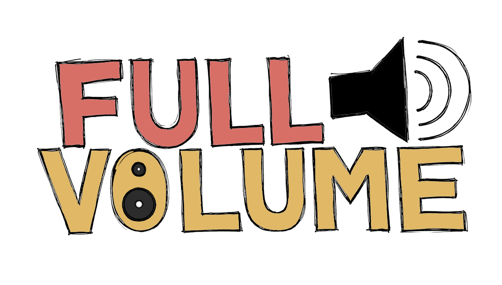
  </a>

### The karaoke game that plays *your own* music library.

A spiritual successor to Xbox 360 *LIPS*, built for PC. Point it at the songs already sitting on your drive and sing any of them - on your own, or in a room online with your mates.

<a href="https://github.com/iamjrmh/FullVolumeTheGame/releases/latest/download/FullVolumeSetup.exe"> **Download FullVolume on GitHub →**</a>

<a href="https://jurmr.itch.io/fullvolume"> **Download FullVolume on itch.io →**</a>

> This repository is the **download and issue tracker** for FullVolume. The game itself is closed source, so there is no game code here - just the installer, the release notes, and somewhere to shout at me when it breaks.

---

## 🎤 What It Is

Every karaoke game wants to sell you the music. FullVolume hasn't got any to sell. It reads the songs already on your drive and turns them into a proper karaoke night: lyrics, pitch, scoring, stars, the lot.

- **It actually hears you** - land the note and it knows, nail it dead centre and it *really* knows. Sing it an octave down if that's where your voice lives, it still counts
- **Your library, not a store** - point it at your Clone Hero or Rock Band folders and it takes it from there. Songs nobody sings on are quietly left out, so you never pick a track and find there's nothing to sing
- **Line up a set list** - queue songs while somebody else is still singing, so the night runs itself instead of stopping dead between every track
- **Online, with voices** - name a room, send it to your mates, and sing together from wherever you are. Voice chat is part of the game, not something you bolt on beside it
- **Make it your room** - every last bit of it is hand drawn, and if you don't fancy the room, drop in a picture or a video of your own and that's your stage instead
- **Tuned to your gear** - one button and it sorts out your audio delay on its own, or tap along for a few bars and let it work you out

---

## 🖥️ Screenshots

Straight out of the game. Nothing here is a mock-up.

  <a href="https://fullvolumethegame.xyz">
  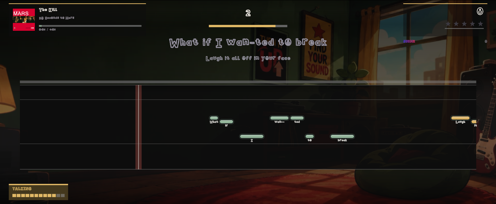
  </a>

<h3 align="center">The menus</h3>

  <a href="https://fullvolumethegame.xyz">
  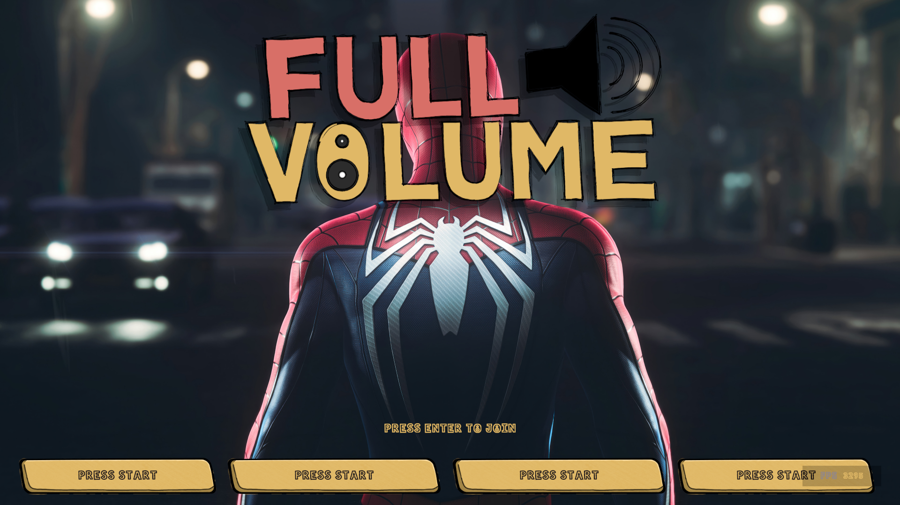
  </a>
  <em>Press start.</em>
    
  <a href="https://fullvolumethegame.xyz">
  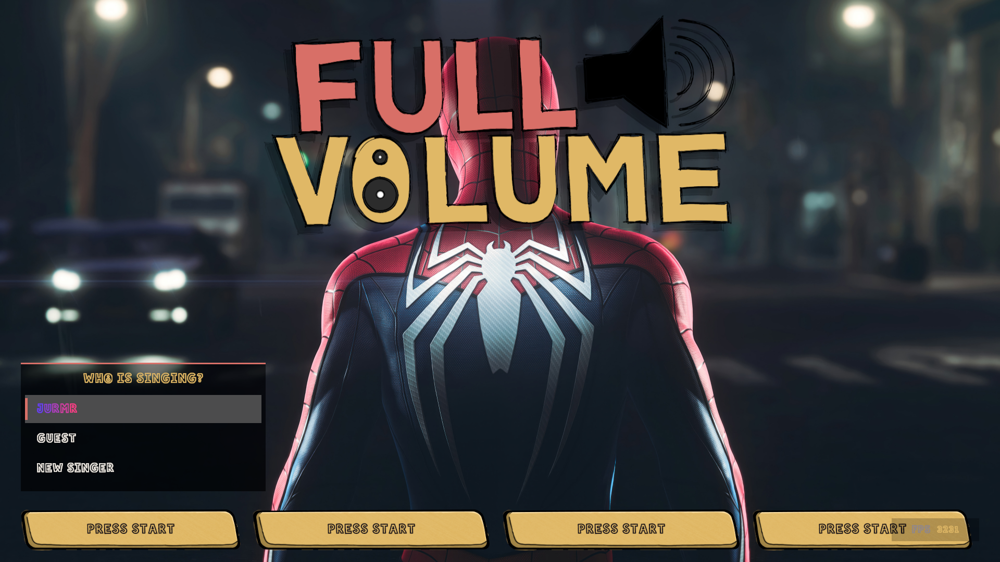
  </a>
  <em>Sign in, play as a guest, or make a profile.</em>
    
  <a href="https://fullvolumethegame.xyz">
  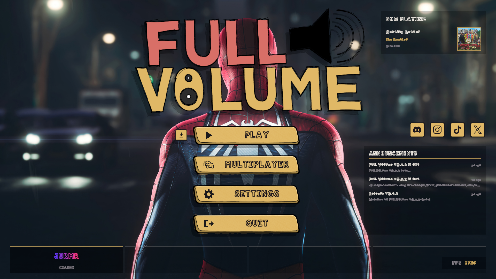
  </a>
  <em>Play, Multiplayer, Settings, Quit.</em>

<h3 align="center">Your library</h3>

  <a href="https://fullvolumethegame.xyz">
  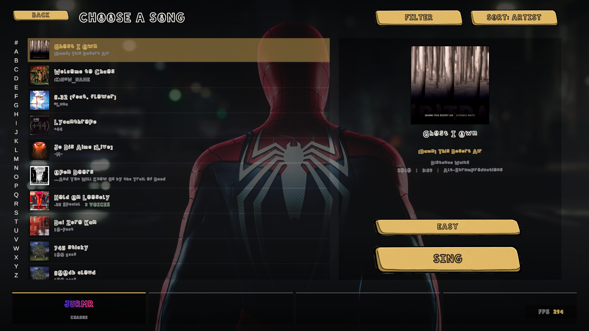
  </a>
  <em>Your library, with your best score on every row.</em>
    
  <a href="https://fullvolumethegame.xyz">
  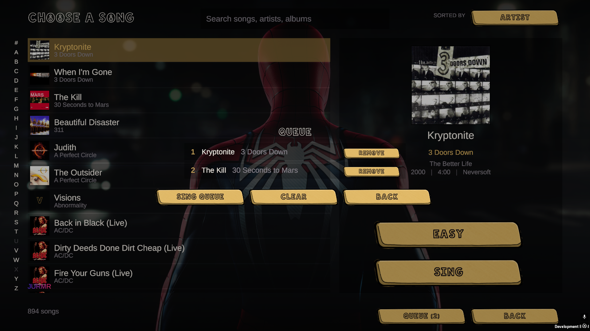
  </a>
  <em>Queue up a set list before anyone argues.</em>

<h3 align="center">Singing</h3>

  <a href="https://fullvolumethegame.xyz">
  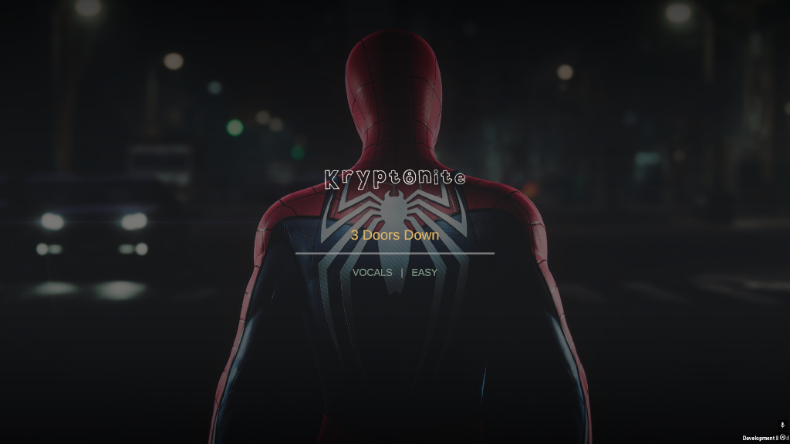
  </a>
  <em>The intro card, while the chart loads.</em>
    
  <a href="https://fullvolumethegame.xyz">
  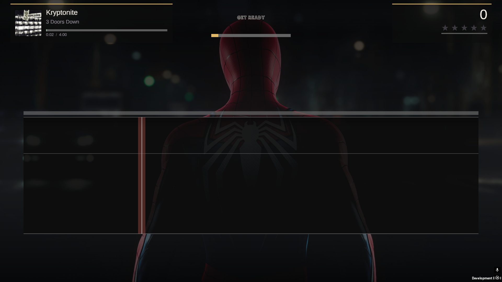
  </a>
  <em>The vocal track, waiting for the first phrase.</em>
    
  <a href="https://fullvolumethegame.xyz">
  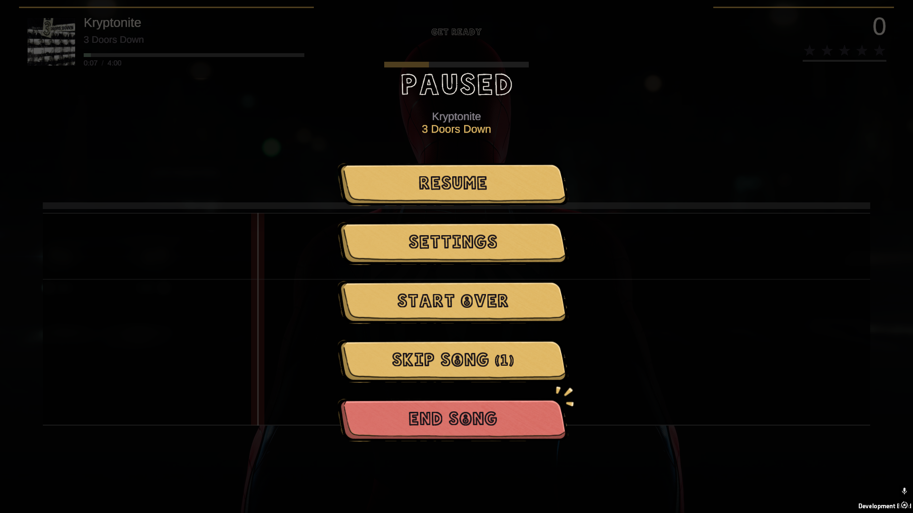
  </a>
  <em>Pause, with the settings you can change mid-song.</em>
    
  <a href="https://fullvolumethegame.xyz">
  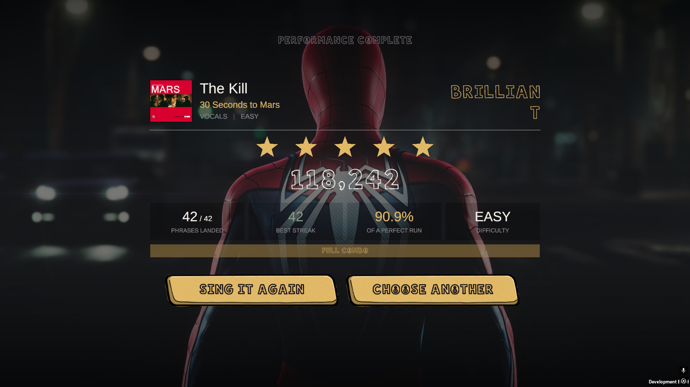
  </a>
  <em>Stars, streak, and how close to perfect you got.</em>

<h3 align="center">Multiplayer</h3>

  <a href="https://fullvolumethegame.xyz">
  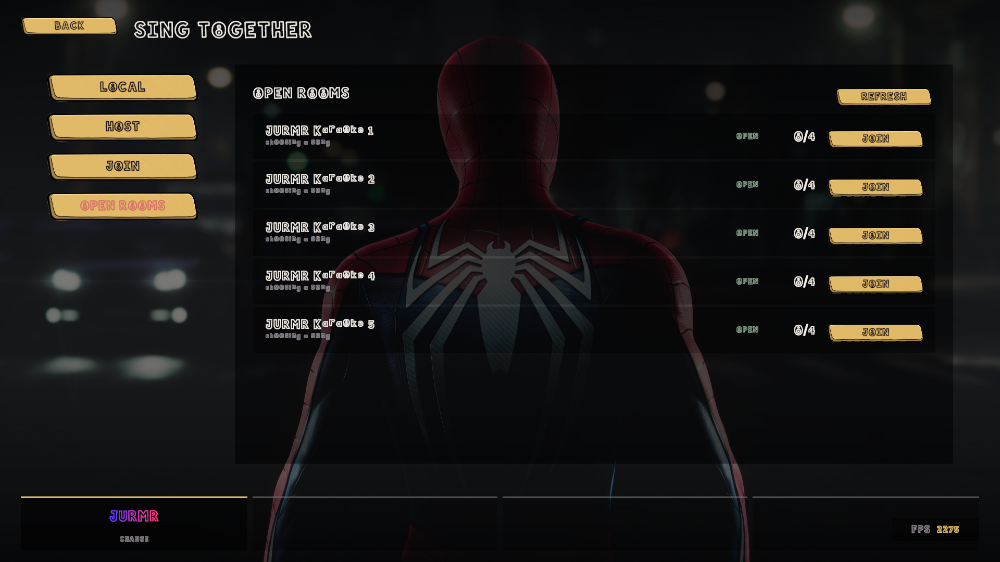
  </a>
  <em>Public rooms, listed and joinable.</em>
    
  <a href="https://fullvolumethegame.xyz">
  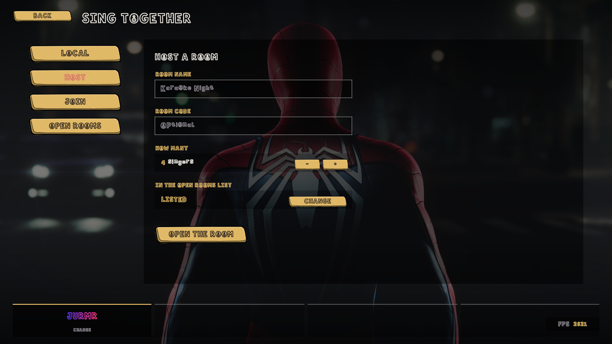
  </a>
  <em>Host one: name it, lock it, cap it.</em>
    
  <a href="https://fullvolumethegame.xyz">
  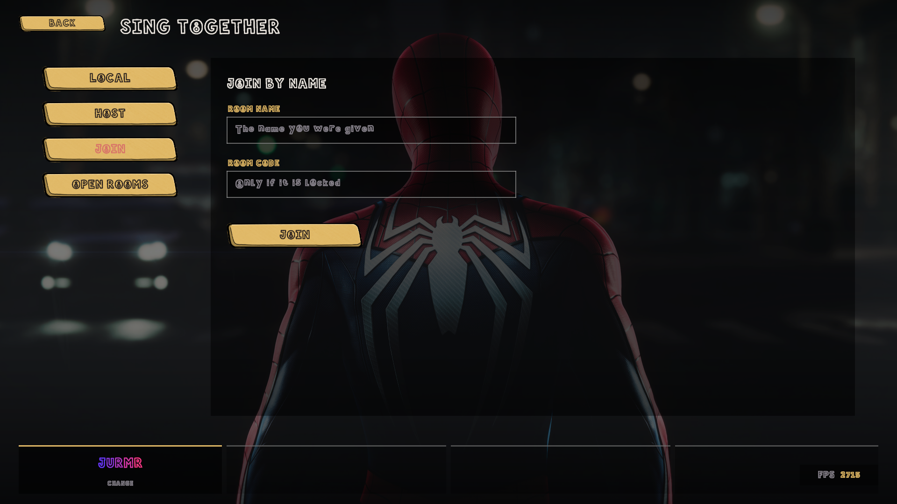
  </a>
  <em>Or join with a name and a code.</em>
    
  <a href="https://fullvolumethegame.xyz">
  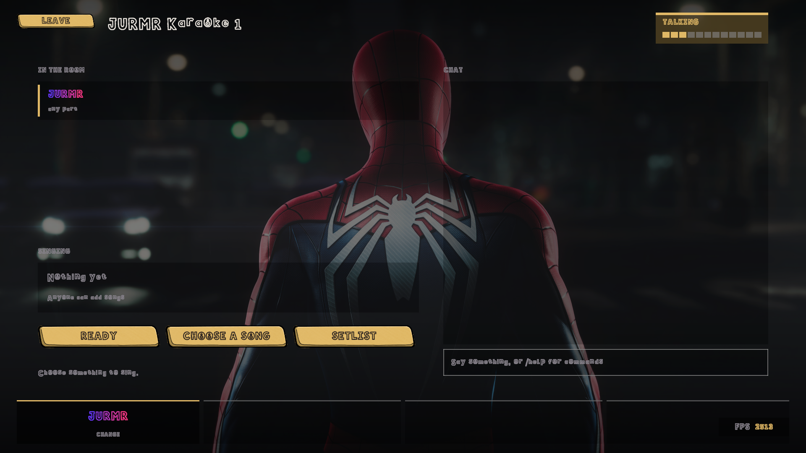
  </a>
  <em>The lobby, with live voice and chat.</em>
    
  <a href="https://fullvolumethegame.xyz">
  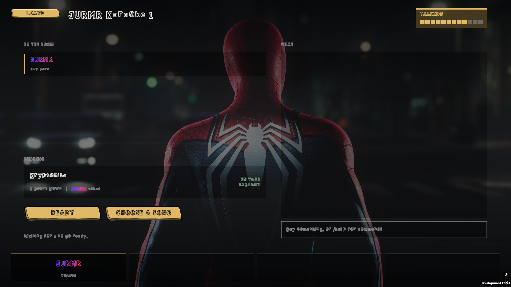
  </a>
  <em>It checks everyone actually has the song.</em>

---

## 📥 Installing

1. Grab **`FullVolumeSetup.exe`** from the [latest release](../../releases/latest).
2. Run it. It installs **per user**, so there is no UAC prompt and no admin rights needed - hand it to four friends and that's four installs and zero arguments with IT.
3. It lands in `%USERPROFILE%\Program Files\Full Volume`, with shortcuts on the Start menu and desktop.
4. Launch it, plug a microphone in, and pick it under **Settings → Audio**.

Uninstall it whenever you like. Profiles, scores, backdrops and song folders live outside the install and are never touched.

| | |
|---|---|
| **File** | `FullVolumeSetup.exe` |
| **Size** | 250 MB |
| **Version** | 0.9.2 beta |
| **Runs on** | Windows 10 and 11, 64-bit |
| **Account** | Local. Nothing to sign up for |
| **Songs included** | None. You bring those |

---

## 🎵 Setting Up Your Songs

If you've already got a Clone Hero song folder, you've already got a set list. Nothing to convert, nothing to import, nothing to buy.

1. **Point it at your songs** - **Settings → Library → Add Folder**. Add as many as you've got, on as many drives as you like.
2. **Put the kettle on** - it reads through them once, tells you how it's getting on, and then remembers. You'll not wait on it again.
3. **Sing** - search it, sort it, pick something, and go. It opens on the list, not on a loading bar.

**What it reads:**

- Clone Hero song folders, exactly as they sit on your drive
- `.sng` archives, read straight out of the file
- Rock Band `_rb3con` packages, no unpacking first
- Album art, so the list looks like your record shelf

Songs with no vocal part are left out of the list on purpose.

### Getting the timing right

Every PC has a different audio delay. **Settings → Calibration** measures it for you in one button press, or you can tap along for a few bars and let it work you out. Do this once and everything lines up.

### Your own backdrops

Drop a picture or a video into `Documents\Full Volume\Custom\Backgrounds` and it turns up in the backdrop carousel. Menus and gameplay each get their own pick, so you can have one for the lobby and another for the stage.

### Where your stuff lives

Everything you make is in **`Documents\Full Volume`** - profiles, scores, your backdrops, and the list of song folders you added. The uninstaller deliberately never touches it.

---

## 🌐 Multiplayer

Host a room from inside the game, send it round, and sing together from wherever you all are.

- Public rooms are listed in the game and joinable in one click, or put a code on one and keep it to yourselves
- Say how many singers it takes and it holds the door at that
- Anyone can queue a song, and it says up front who hasn't got it
- Open mics in the lobby, push to talk once a song starts, so nobody's singing comes back at you over the music
- Everyone stays in time wherever they are, with everybody's score on screen at once

---

## 🧰 System Requirements

<table>
<tr><th></th><th>Minimum</th><th>Recommended</th></tr>
<tr><td><b>OS</b></td><td>Windows 10, 64-bit</td><td>Windows 11, 64-bit</td></tr>
<tr><td><b>Processor</b></td><td>Any dual core from the last ten years</td><td>Any quad core</td></tr>
<tr><td><b>Memory</b></td><td>4 GB RAM</td><td>8 GB RAM</td></tr>
<tr><td><b>Graphics</b></td><td>Anything that does DirectX 11</td><td>DirectX 12 or Vulkan</td></tr>
<tr><td><b>Storage</b></td><td>200 MB available space</td><td>200 MB, plus room for your songs</td></tr>
<tr><td><b>Sound</b></td><td>A microphone. Any microphone.</td><td>A headset or USB microphone</td></tr>
</table>

You bring the songs. A Clone Hero or Rock Band library is all it asks for.

---

## 🐛 Something Broken?

Open an [issue](../../issues) and say what you were doing, what happened, and which version you're on. If it crashed, the log is at `%USERPROFILE%\AppData\LocalLow\JURMR\FullVolume\Player.log` - attach it and I'll have a far better idea what went wrong.

---

  

**Sing badly, loudly.** The only rule.

Made by **JURMR**.
[fullvolumethegame.xyz](https://fullvolumethegame.xyz)

© 2026 JURMR. FullVolume is not affiliated with Clone Hero, YARG, Harmonix or Microsoft.

