

  <a href="https://fullvolumethegame.xyz/api/download/game">
    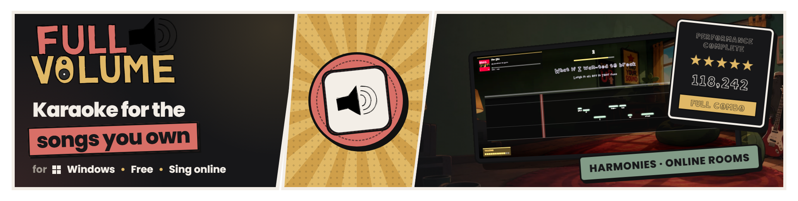
  </a>

# FullVolume

  FullVolume is karaoke for the songs you already own, a spiritual successor to Xbox 360 <i>LIPS</i>. Point it at your Clone Hero, Rock Band or UltraStar folders and sing any of them, on your own or in an online room with your friends. 
  Runs on Windows 10 and 11.

  

## Screenshots

  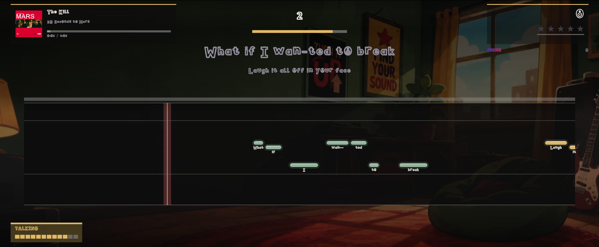

| | |
|:---:|:---:|
| 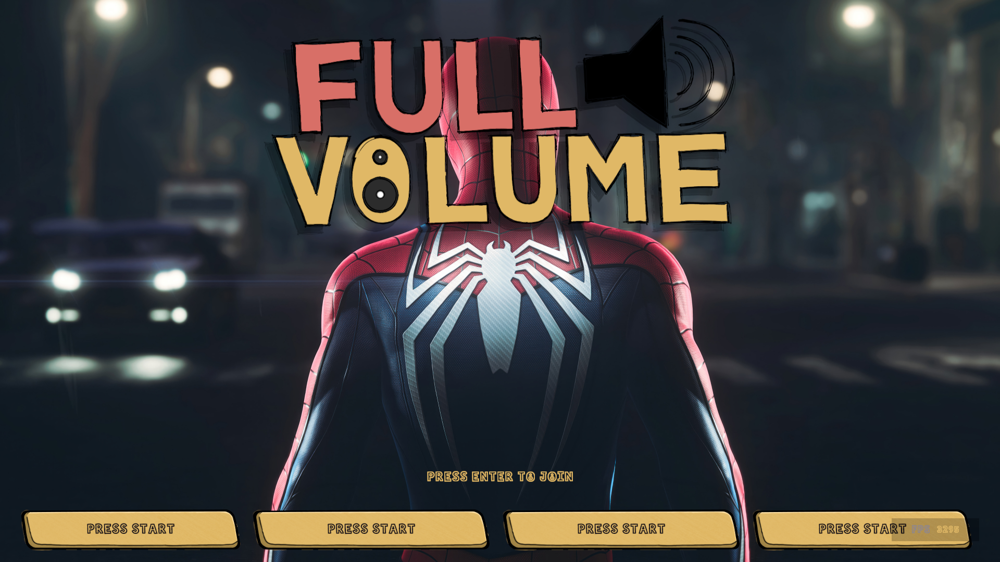 | 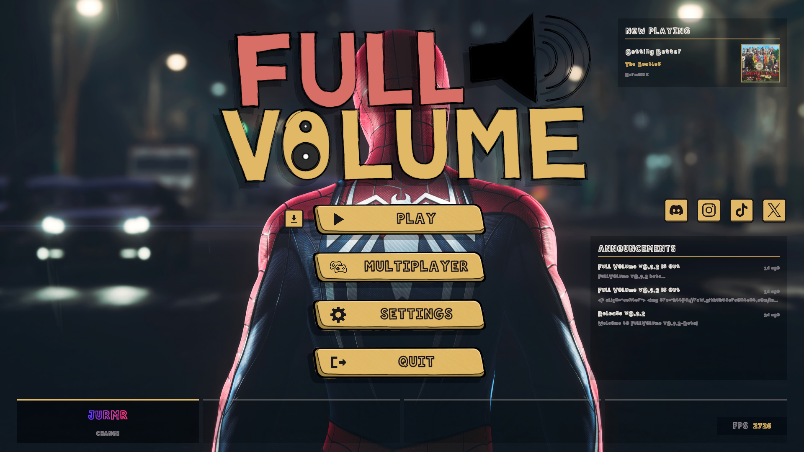 |
| Title screen | Main menu |
| 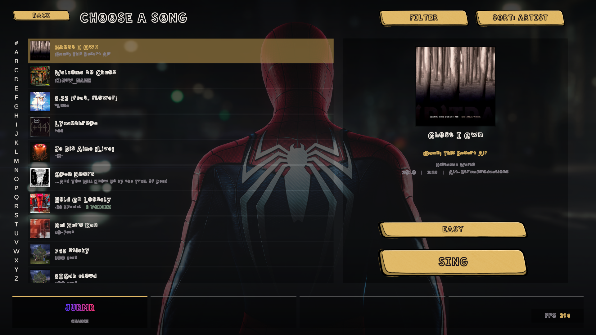 | 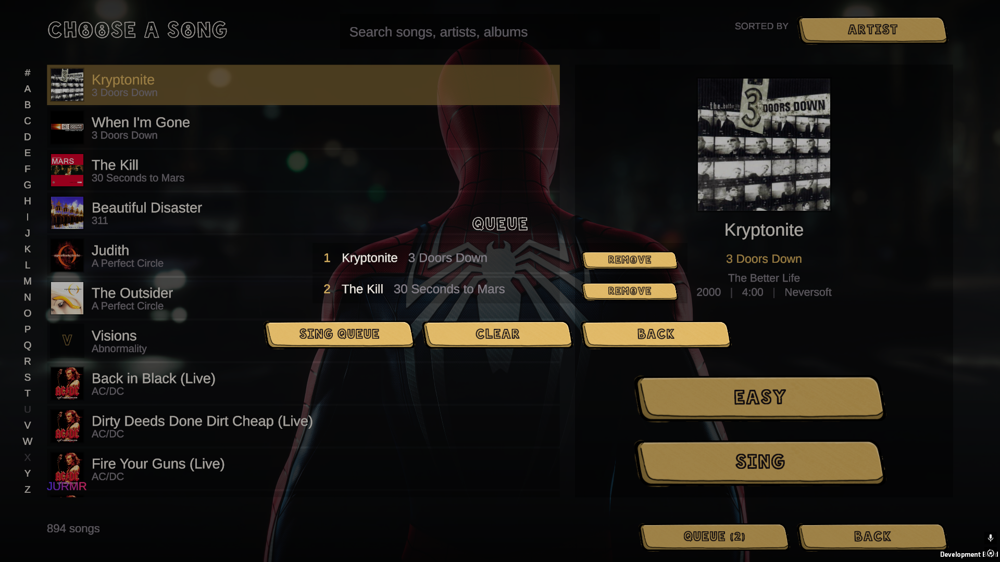 |
| Your library, with your best score on every song | Queue up a set list |
| 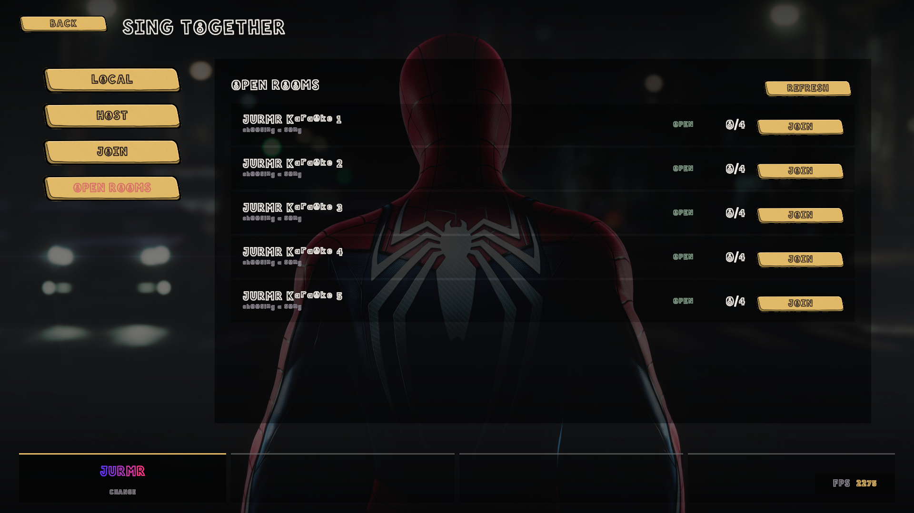 | 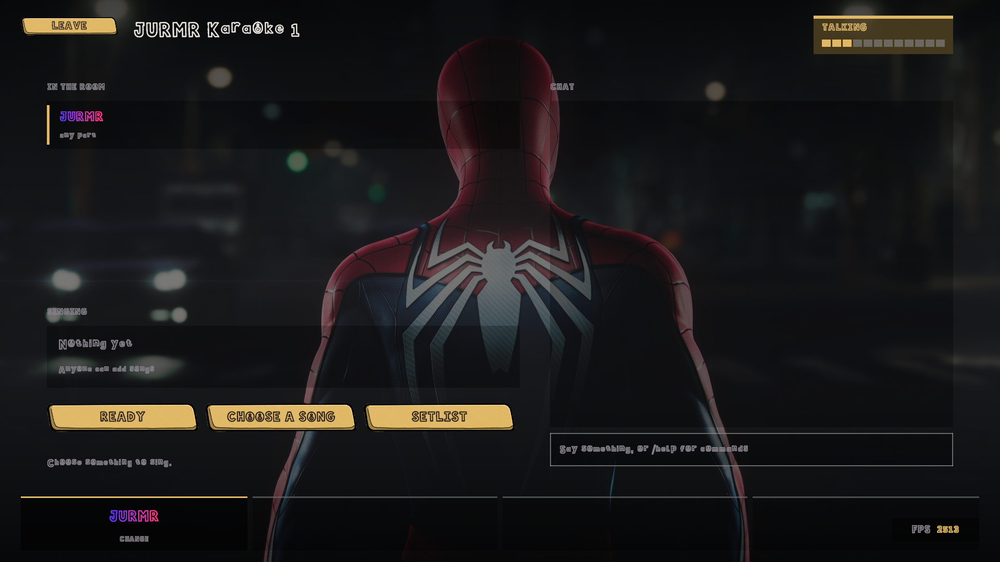 |
| Public rooms | The lobby, with voice and chat |
| 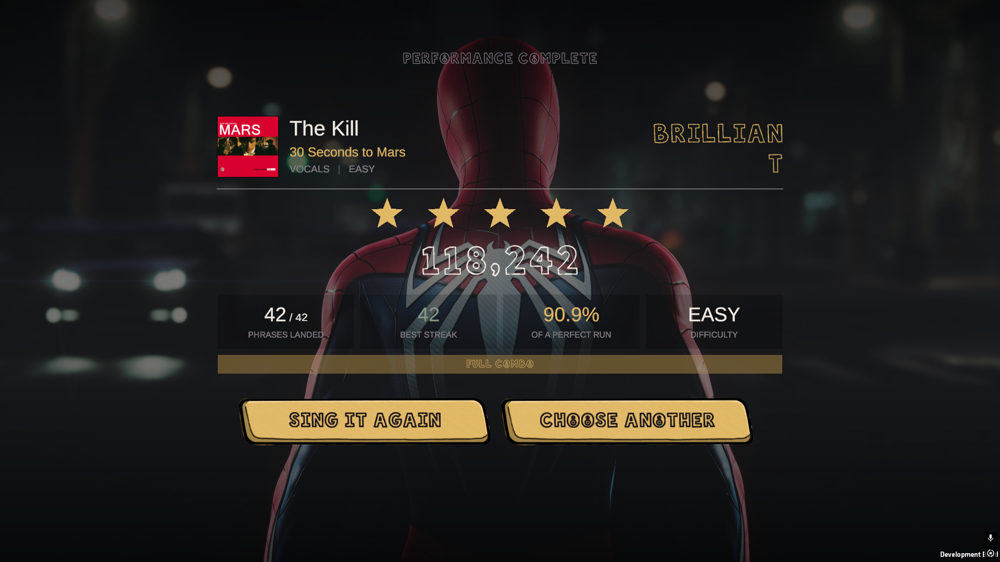 | 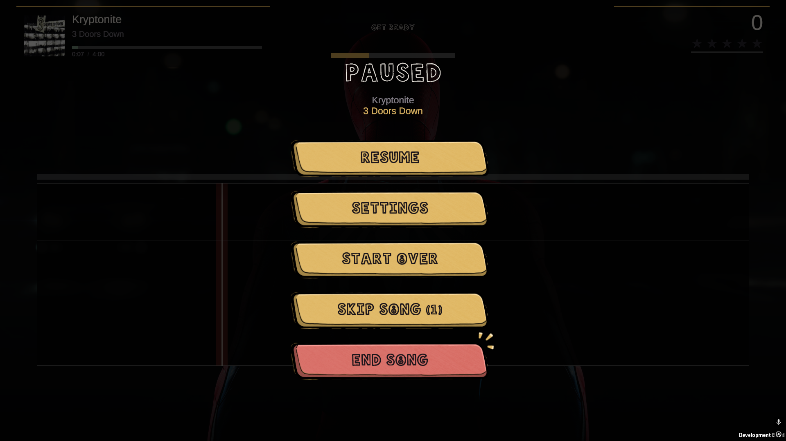 |
| Results | Pause menu |

## Download

Grab the latest installer from [fullvolumethegame.xyz](https://fullvolumethegame.xyz/api/download/game), the [Releases page](../../releases/latest) or [itch.io](https://jurmr.itch.io/fullvolume).

| | |
|---|---|
| **Version** | 0.9.7 beta |
| **Runs on** | Windows 10 and 11, 64-bit |
| **Installer** | `FullVolumeSetup.exe`, per user, no admin |

FullVolume updates itself after that. It ships with no songs: add your folders under **Settings → Library**, pick your mic under **Settings → Audio**, and run **Settings → Calibration** once. This repository is the download page and issue tracker; the game itself is closed source.

## Features

- Reads Clone Hero folders, `.sng` archives, Rock Band `_rb3con` packages, UltraStar `.txt` and `.fvchart`, straight off your drives
- Phrase-based pitch scoring that accepts any octave, with overdrive, streaks and five stars for a full combo
- Harmonies, up to three parts dealt out around the room
- Online rooms with built-in voice chat, public or code-locked, and a check that everyone has the song
- A set list queue, so the night doesn't stop between songs
- **GET SONGS**: search and download charts from Rhythmverse and Chorus Encore in-game
- Per-singer profiles with your own note, lyric and name colours
- Custom backdrops: drop a picture or video in `Documents\Full Volume\Custom\Backgrounds`
- One-button audio calibration
- Auto-updates

## FullVolumeCharter

The song you want isn't charted? **FullVolumeCharter** turns any song you own into a `.fvchart`: load the audio, paste the lyrics, tap the timing, fix the pitches and export. It can split the vocals out of a full mix on your GPU, slows the song down without changing its key while you tap, and turns bracketed backing vocals into harmony parts. Everything stays on your PC.

  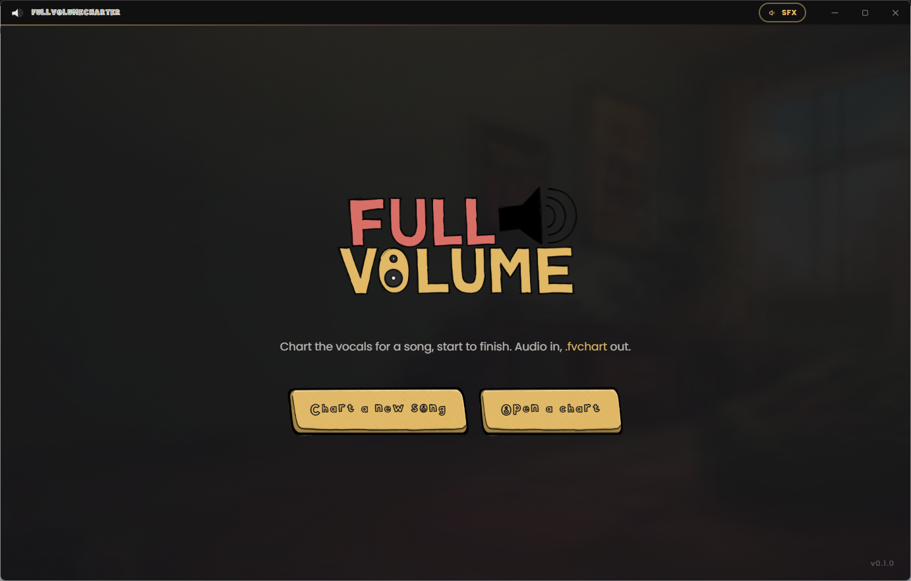

[**Download FullVolumeCharter**](https://fullvolumethegame.xyz/api/download/charter) &nbsp;•&nbsp; [More about it](https://fullvolumethegame.xyz/fullvolumecharter/)

| | |
|---|---|
| **Charter version** | 0.9.7 |
| **Built for** | FullVolume 0.9.7 |

The charter has its own version and release schedule. A chart made with any version plays in any version of the game.

## Bugs

Open an [issue](../../issues) with what you were doing, what happened, and your version. If it crashed, attach `%USERPROFILE%\AppData\LocalLow\JURMR\FullVolume\Player.log`.

## Credits

- **The charting community.** Every vocal part FullVolume plays was charted by hand, for free, by Rock Band, Clone Hero and UltraStar charters.
- **The Rock Band modding community**, especially **TrojanNemo** ([Nautilus](https://github.com/trojannemo/Nautilus)), **LocalH** (moggulator) and **Dark** (themethod3), whose reverse engineering of CON and mogg files is the only reason they can be read. FullVolume's mogg support is its own C# implementation of that published work; no code from these projects is included.
- **[Rhythmverse](https://rhythmverse.co)** and **[Chorus Encore](https://enchor.us)** for the chart catalogues behind GET SONGS. Downloads go through their own pages, and nothing is mirrored.
- Built on **Unity 6**, [NVorbis](https://github.com/NVorbis/NVorbis), [Concentus](https://github.com/lostromb/concentus), [LiteNetLib](https://github.com/RevenantX/LiteNetLib), [Kenney](https://kenney.nl) sounds and [Simple Icons](https://github.com/simple-icons/simple-icons). Pitch detection is the McLeod Pitch Method. The charter uses [Tauri 2](https://tauri.app), [React](https://react.dev), [hyphen](https://github.com/ytiurin/hyphen) and [UVR](https://github.com/Anjok07/ultimatevocalremovergui)'s karaoke model.

The menu background was generated with ChatGPT; that is the only AI art in the game. Much of the code was written with AI assistance (Anthropic's Claude), directed, reviewed and tested by me. No song, chart, lyric or audio is AI generated, and nothing in the game talks to an AI service.

FullVolume ships no music and is not affiliated with Harmonix, Epic Games, Microsoft, Clone Hero, YARG, Rhythmverse, Chorus, UltraStar or any of the projects above. © 2026 JURMR · [Terms](https://fullvolumethegame.xyz/terms/) · [Privacy](https://fullvolumethegame.xyz/privacy/) · [FAQ](https://fullvolumethegame.xyz/faq/)
